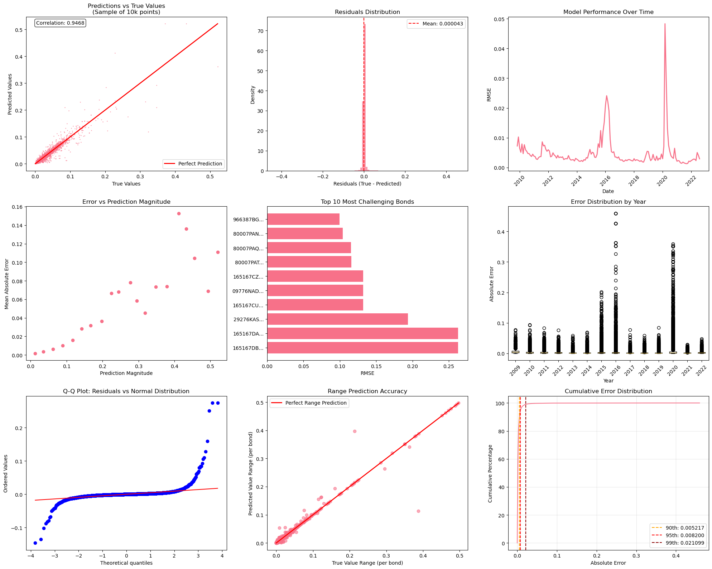

Results
=======

This page summarises the empirical outputs embedded in the original notebook for the
1‑month horizon (H=1) run of the advanced ensemble U‑MIDAS pipeline.

Dataset coverage
----------------

- Number of predictions: **630,763**
- Number of unique bonds: **14,222**
- Date range: **2009‑11‑30** to **2022‑08‑31**

Headline accuracy (H=1)
-----------------------

The notebook’s saved summary for ``method=advanced_ensemble`` at ``H=1`` reports the
following *micro* (pooled) and *macro* (bond‑averaged) metrics.

.. list-table:: Saved metrics row (as written to CSV)
   :header-rows: 1
   :widths: 6 14 10 10 10 10 10 10 10

   * - H
     - method
     - micro_RMSE
     - micro_MAE
     - micro_R2
     - micro_sMAPE_pct
     - macro_RMSE_mean
     - macro_MAE
     - macro_PAE_pct
   * - 1
     - advanced_ensemble
     - 0.007499253
     - 0.002651644
     - 0.8941128
     - 13.9633368
     - 0.004461926
     - 0.002950839
     - 16.99357

Additional saved fields include:

- ``micro_MPE_pct = -1.9658`` (signed percent error with :math:`|y|` denominator)
- ``micro_rRMSE_pct = 34.7287``
- ``macro_sMAPE_pct = 15.7640``
- ``macro_rRMSE_pct = 23.7441``

Interpretation
^^^^^^^^^^^^^^

- The micro :math:`R^2` of ~0.894 indicates that the ensemble explains a large fraction
  of pooled variance in spread levels.
- The micro RMSE of ~0.0075 is consistent with the tail behaviour shown in the
  diagnostic plots: most errors are small, with stress‑episode outliers.
- Macro errors (averaged across bonds) are of similar order, but macro metrics are
  sensitive to bonds with short histories.

Important caveat on ``macro_R2_mean``
^^^^^^^^^^^^^^^^^^^^^^^^^^^^^^^^^^^^^

The saved CSV row shows ``macro_R2_mean = -731762.7225`` (extremely negative).
This is a known failure mode of mean per‑bond :math:`R^2` when some bonds have
near‑constant targets over their available evaluation rows. In such cases the
per‑bond total sum of squares can be numerically tiny, producing unbounded negative
:math:`R^2`. For publication‑quality reporting we recommend focusing on macro RMSE,
macro MAE, or reporting robust summaries of per‑bond :math:`R^2` (median / trimmed
mean), rather than the raw mean.

Baseline and the “naive RMSE = 0” issue
---------------------------------------

The notebook output prints ``Naive RMSE: 0.000000`` and the saved CSV contains:

- ``naive_micro_RMSE = 0``
- ``naive_macro_RMSE_mean = 0``
- improvement percentages that are effectively infinite.

This does **not** represent a meaningful forecasting baseline. It arises when the
baseline is inadvertently evaluated on a perfect‑fit merge (e.g., reusing the same‑date
true level as the “prediction”), which mechanically yields zero error.

For a level forecast at horizon :math:`H`, the appropriate random‑walk/no‑change
baseline is:

.. math::

   \widehat{cs}^{RW}_{i,t} = cs_{i,t-H}.

See :eq:`eq:rw_baseline` in the *Research Paper Style Documentation* page for the full
definition and the evaluation protocol implemented in this package.

Distributional diagnostics
--------------------------

From the notebook run:

- Correlation between ``y_true`` and ``y_pred``: **0.9468**
- Mean residual (bias): **4.7e‑05**
- 90th percentile absolute error: **0.005212**
- 95th percentile absolute error: **0.008193**
- 99th percentile absolute error: **0.021099**

The ratio of the 95th percentile absolute error to the median absolute error is
approximately **5.92**, indicating a fat‑tailed error distribution (tail risk).

Temporal behaviour
------------------

Monthly RMSE is generally stable over the sample with pronounced spikes around market
stress episodes. The worst‑performing months reported by the notebook were:

- 2020‑03 (RMSE ≈ 0.0483)
- 2020‑04 (RMSE ≈ 0.0296)
- 2016‑02 (RMSE ≈ 0.0241)
- 2016‑03 (RMSE ≈ 0.0222)
- 2016‑01 (RMSE ≈ 0.0208)

Conditional performance by credit spread level
----------------------------------------------

The notebook summarised RMSE by bins of the true credit spread level:

+-------------------+-----------+--------+
| Credit spread bin | RMSE      | Count  |
+===================+===========+========+
| Very Low (<1%)    | 0.001879  | 174,217|
+-------------------+-----------+--------+
| Low (1–2%)        | 0.002654  | 225,680|
+-------------------+-----------+--------+
| Medium (2–5%)     | 0.004840  | 185,075|
+-------------------+-----------+--------+
| High (5–10%)      | 0.014094  | 38,704 |
+-------------------+-----------+--------+
| Very High (>10%)  | 0.054753  | 7,087  |
+-------------------+-----------+--------+

As expected for a level target, error magnitude increases with the scale of the spread
(heteroskedasticity).

Diagnostic figure
-----------------

The following figure is extracted from the notebook output. It includes scatter,
residual and Q–Q diagnostics, temporal RMSE, per‑year error distributions, and tail
error concentration.

